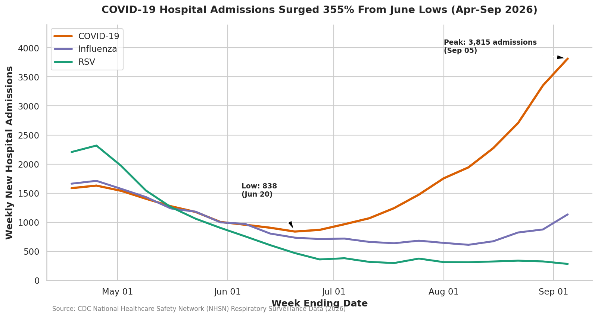
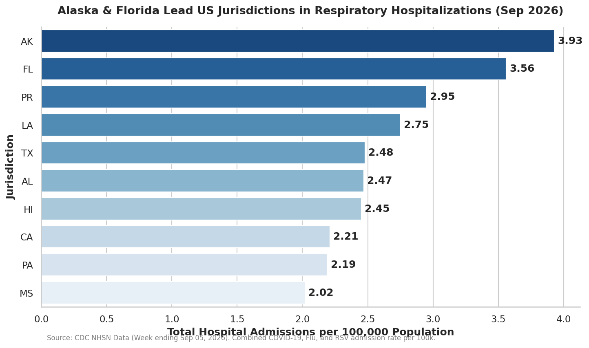
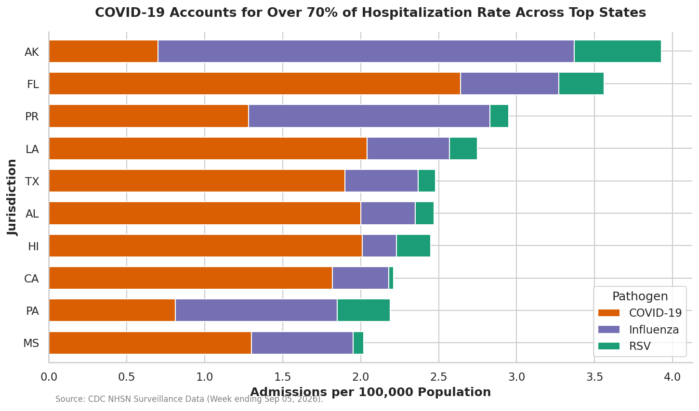

# CDC NHSN Hospital Respiratory Surveillance Dashboard (2026)


## 📌 Executive Overview

This repository provides an automated data analysis pipeline and visualization suite analyzing weekly US hospital admission levels and rates for **COVID-19**, **Influenza**, and **Respiratory Syncytial Virus (RSV)** from April to September 2026. The data is sourced from the National Healthcare Safety Network (NHSN) dataset published by the Centers for Disease Control and Prevention (CDC).

### 🔑 Key Analytical Findings

1. **COVID-19 Late-Summer Surge (+355%)**: National weekly COVID-19 hospital admissions reached a summer low of **838** in late June 2026 before surging **355%** to **3,815** admissions by September 5, 2026.
2. **Pathogen Divergence**: While COVID-19 hospitalizations sharply increased throughout July and August, RSV hospitalizations trended downwards from **2,318** in April to **281** in September. Influenza admissions exhibited a modest late-summer rebound to **1,133** admissions.
3. **Regional Hotspots**: As of September 2026, **Alaska** (3.93 per 100k), **Florida** (3.56 per 100k), **Puerto Rico** (2.95 per 100k), and **Louisiana** (2.75 per 100k) exhibited the highest combined respiratory admission rates in the nation.
4. **Disease Burden Dominance**: COVID-19 represented over **70%** of total respiratory hospitalizations across the top 10 impacted jurisdictions.

---

## 📊 Visualizations & Dashboard

### 1. National Respiratory Hospitalization Trends (Apr–Sep 2026)


*Tracking national weekly new hospital admissions across COVID-19, Influenza, and RSV.*

---

### 2. Top 10 Jurisdictions by Combined Admission Rate per 100k


*Combined hospital admission rates per 100,000 population across top US states and territories.*

---

### 3. Pathogen Disease Burden Breakdown


*Stacked pathogen breakdown comparing COVID-19, Influenza, and RSV rates in peak jurisdictions.*

---

## 📁 Repository Structure

```text
.
├── data/
│   └── Weekly_Hospital_Respiratory_Admission_Levels_and_Rates_by_J.csv
├── scripts/
│   └── analyze_respiratory_data.py
├── visualizations/
│   ├── national_respiratory_trends.png
│   ├── top_jurisdictions_admission_rates.png
│   └── pathogen_disease_burden_breakdown.png
├── README.md
└── requirements.txt
```

---

## 🚀 Getting Started

### Prerequisites

- Python 3.10+
- Dependencies: `pandas`, `matplotlib`, `seaborn`, `numpy`

```bash
git clone https://github.com/your-username/cdc-respiratory-surveillance-2026.git
cd cdc-respiratory-surveillance-2026
pip install -r requirements.txt
```

### Running the Analysis

To execute the data processing pipeline and regenerate all chart figures:

```bash
python scripts/analyze_respiratory_data.py
```

---

## 🔬 Methodology & Data Source

- **Data Source**: CDC National Healthcare Safety Network (NHSN) Weekly Hospital Respiratory Admission Levels and Rates.
- **Metrics Evaluated**:
  - `totalConfC19NewAdm`, `totalConfFluNewAdm`, `totalConfRSVNewAdm` (Weekly Admission Counts)
  - `totalConfC19NewAdmPer100k`, `totalConfFluNewAdmPer100k`, `totalConfRSVNewAdmPer100k` (Population-Normalized Rates per 100k)
- **Timeframe**: April 18, 2026 – September 05, 2026 (21 surveillance weeks across 57 US jurisdictions).

---

## 👤 Author & Contact

**Data Analyst / Health Data Scientist**

[GitHub Profile](https://github.com/laar14)  
[LinkedIn Profile](https://www.linkedin.com/in/liyerpt/)


